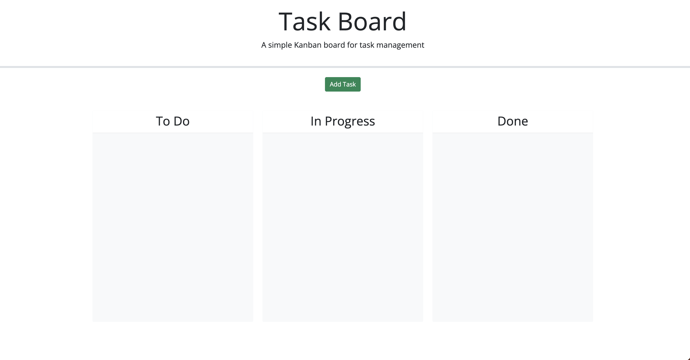
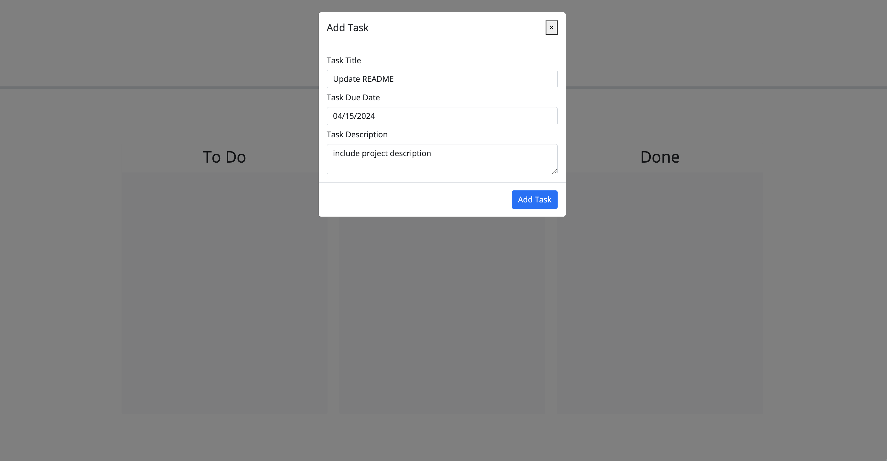
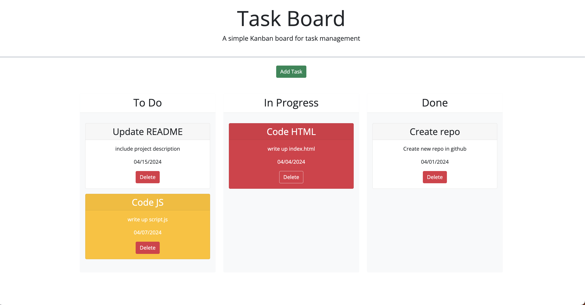

# Module 05 Challenge: Third-Party APIs / Task Board

## Description
This is the challenge for Module 05 of the coding bootcamp. This is a task board that allows a team to manage project tasks by letting members add, move, and delete cards and giving them a way to track progress.

### User Story
```
AS A project team member with multiple tasks to organize
I WANT a task board 
SO THAT I can add individual project tasks, manage their state of progress and track overall project progress accordingly
```

### Acceptance Criteria
```
GIVEN a task board to manage a project
WHEN I open the task board
THEN the list of project tasks is displayed in columns representing the task progress state (Not Yet Started, In Progress, Completed)
WHEN I view the task board for the project
THEN each task is color coded to indicate whether it is nearing the deadline (yellow) or is overdue (red)
WHEN I click on the button to define a new task
THEN I can enter the title, description and deadline date for the new task into a modal dialog
WHEN I click the save button for that task
THEN the properties for that task are saved in localStorage
WHEN I drag a task to a different progress column
THEN the task's progress state is updated accordingly and will stay in the new column after refreshing
WHEN I click the delete button for a task
THEN the task is removed from the task board and will not be added back after refreshing
WHEN I refresh the page
THEN the saved tasks persist
```

## Deployed Application
The project has been deployed [here](https://kristyyip.github.io/module-05-task-board/).

The user will first see a blank task board (if there's no tasks in local storage) and have the option to add any tasks.


After clicking the `Add Task` button, the user will then be prompted to add the task information through a modal/form.


For every task added, a card will be created and placed on the board. The user can then move these cards to their respective status. There is also color-coding to indicate urgency based on deadline.


## Citations
Clark, Ian (2013). "How Can I Ensure Dragged Element Clone Retains Original's Width." JavaScript. https://stackoverflow.com/questions/14886424/how-can-i-ensure-dragged-element-clone-retains-originals-width. (script.js)

Fadhil, Rahman (2019). "How to Generate Unique ID in JavaScript.' JavaScript. https://dev.to/rahmanfadhil/how-to-generate-unique-id-in-javascript-1b13. (script.js)

W, James (2022). "How Can I Remove a Specific Item from an Array?" JavaScript. https://sentry.io/answers/remove-specific-item-from-array/. (script.js)